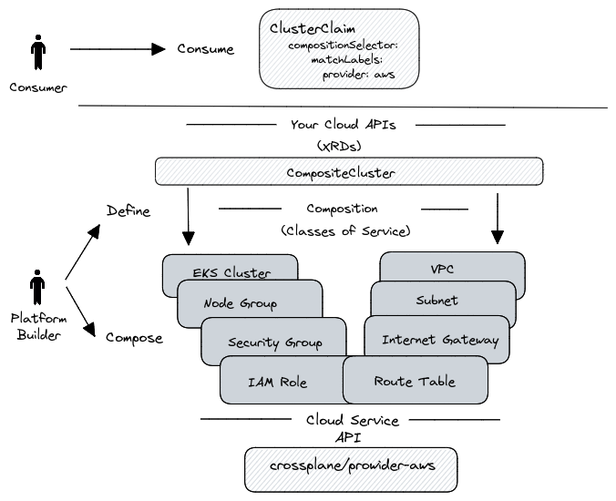

## Production-Ready Amazon EKS cluster using Crossplane

This example shows how to create production-ready EKS CLuster using the Crossplane.

### Prerequisites
Please make sure to install the following tools on your machine before moving on.
- Minikube, Kind, or EKS Cluster
- Kubectl


The figure below provides an overview of the configuration of the demo.



First create a namespaces `crossplane-system` and `team-a` with the following command:

After creating the "crossplane-system" namespace, write your AWS credentials to `aws-creds.conf` file and create a secret with the following command.
```
kubectl -n crossplane-system \
    create secret generic aws-creds \
    --from-file creds=./aws-creds.conf
```

After these steps are completed, Install the necessary tools and configuration files with the following commands.
```
helm upgrade --install \
    crossplane crossplane-stable/crossplane \
    --namespace crossplane-system \
    --create-namespace \
    --wait
```
```
kubectl apply \
    --filename crossplane-config/provider-aws.yaml
```
```
kubectl apply \
    --filename crossplane-config/provider-config-aws.yaml
```

> :warning: If the output is "unable to recognize," wait a couple of seconds and re-run the previous command!
```
kubectl apply \
    --filename crossplane-config/provider-helm.yaml
```
```
kubectl apply \
    --filename crossplane-config/provider-kubernetes.yaml
```
```
kubectl apply \
    --filename crossplane-config/config-k8s.yaml
```

Run the following command and wait until all packages are ready.
```
kubectl get pkgrev
```

Now it is time to provision our production-ready EKS cluster. Use the "aws-eks.yaml" file to provision the EKS cluster with the following command.
```
kubectl -n team-a apply -f aws-eks.yaml
```

The last step is to get the “kubeconfig” file to use our EKS cluster. Run the following commands to get and set the “kubeconfig” file.

```
kubectl --namespace crossplane-system \
    get secret team-a-eks-cluster \
    --output jsonpath="{.data.kubeconfig}" \
    | base64 -d >kubeconfig.yaml

export KUBECONFIG=$PWD/kubeconfig.yaml
```

## Destroy

Run the following command to destroy your resources.

```
unset KUBECONFIG

kubectl --namespace team-a delete \
    --filename examples/aws-eks.yaml
```
